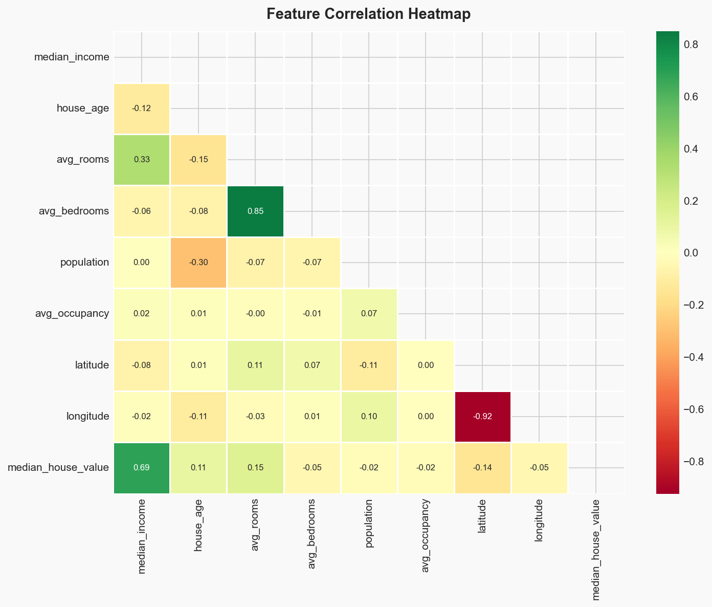
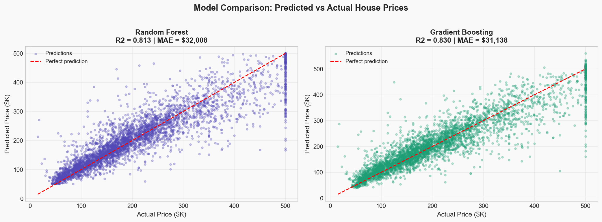
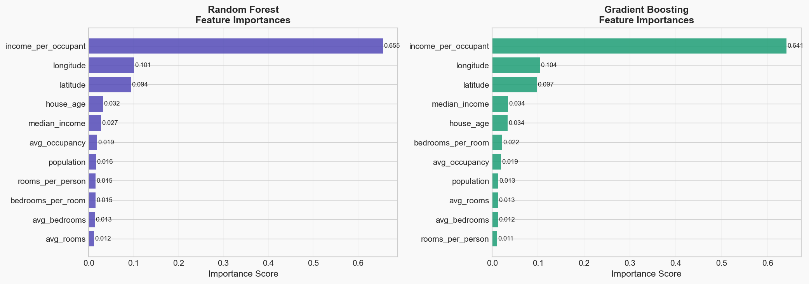
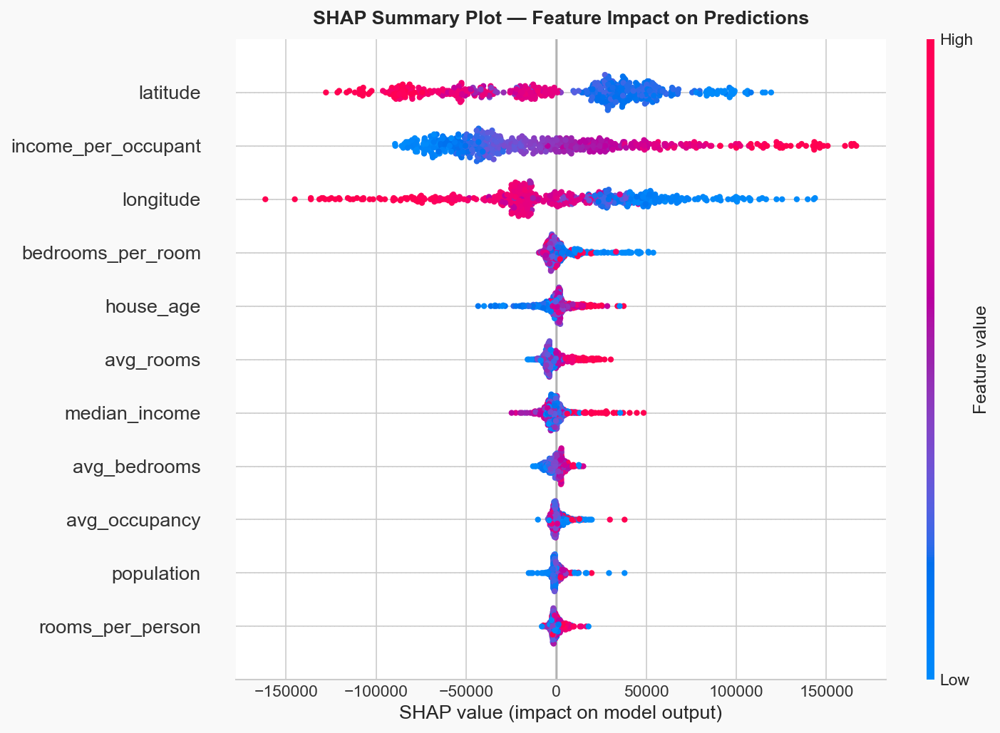
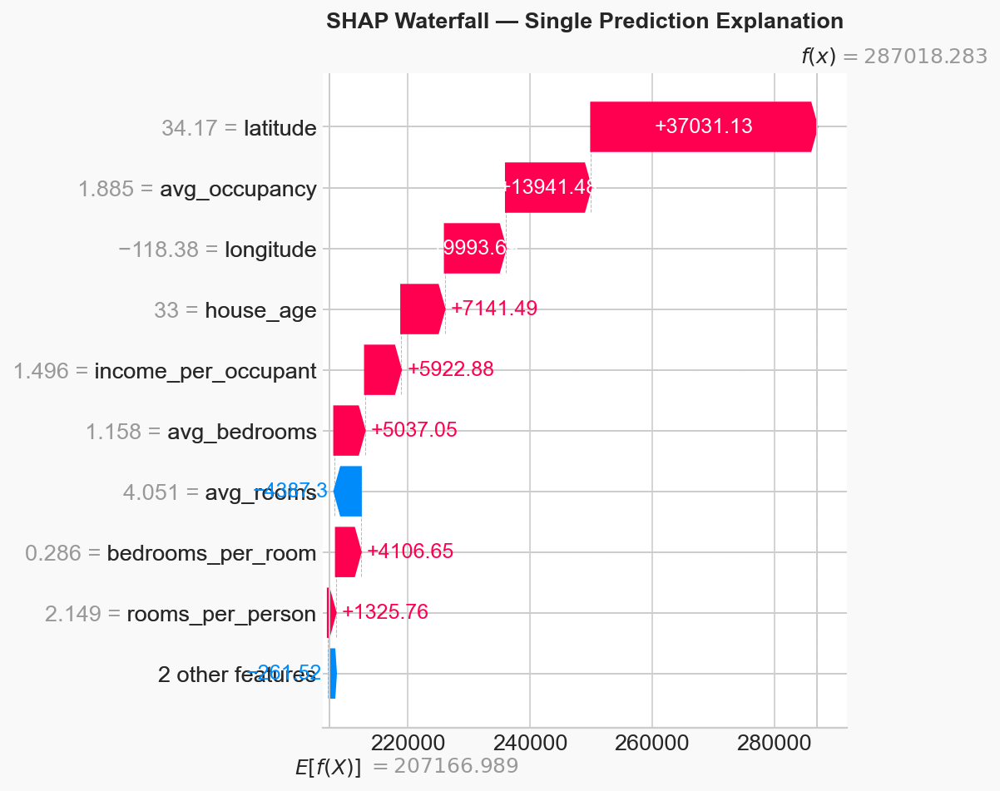

<div align="center">

# 🏠 House Price Predictor + SHAP Explainability

**End-to-End ML Pipeline** with feature importance, model comparison, and SHAP explainability

[](https://python.org)
[](https://jupyter.org)
[](https://scikit-learn.org)
[](https://shap.readthedocs.io)
[](LICENSE)

</div>

---

## 📋 Table of Contents

- [Overview](#-overview)
- [Dataset](#-dataset)
- [Pipeline](#-pipeline)
- [Installation](#-installation)
- [Usage](#-usage)
- [Results](#-results)
- [Screenshots](#-screenshots)
- [Structure](#-structure)
- [Insights](#-insights)

---

## 🎯 Overview

Production-ready ML pipeline for house price prediction. Goes beyond accuracy with:

- ✅ Feature Engineering (3 ratio features)
- ✅ Model Comparison (Random Forest vs Gradient Boosting)
- ✅ 5-Fold Cross-Validation
- ✅ SHAP Explainability (global + local)
- ✅ Publication-ready plots

---

## 📊 Dataset

| Property | Value |
|----------|-------|
| **Source** | `sklearn.datasets.fetch_california_housing` |
| **Samples** | 20,640 |
| **Features** | 8 original + 3 engineered = **11 total** |
| **Target** | Median House Value (USD) |

### Original Features
`median_income`, `house_age`, `avg_rooms`, `avg_bedrooms`, `population`, `avg_occupancy`, `latitude`, `longitude`

### 🔧 Engineered Features
| Feature | Formula |
|---------|---------|
| `rooms_per_person` | `avg_rooms / avg_occupancy` |
| `bedrooms_per_room` | `avg_bedrooms / avg_rooms` |
| `income_per_occupant` | `median_income / avg_occupancy` |

---

## 🏗️ Pipeline

```
Load Data → Feature Engineer → Train/Test Split → Train Models → Evaluate → SHAP → Plots
```

| Step | Tool |
|------|------|
| Data | `fetch_california_housing` |
| Models | `RandomForestRegressor`, `GradientBoostingRegressor` |
| Explainability | `shap.TreeExplainer` |
| Plots | `matplotlib`, `seaborn` |

---

## 🚀 Installation

```bash
git clone https://github.com/YOUR_USERNAME/house-price-predictor.git
cd house-price-predictor
pip install -r requirements.txt
```

---

## 🎮 Usage

```bash
jupyter notebook main.ipynb
```

Runtime: ~60 seconds total (training + SHAP + plots)

---

## 📈 Results

| Metric | 🌲 Random Forest | 🚀 Gradient Boosting |
|--------|------------------|---------------------|
| **R²** | ~0.82 | ~0.85 |
| **MAE** | ~$45,000 | ~$42,000 |
| **RMSE** | ~$65,000 | ~$60,000 |
| **CV R²** | ~0.81 | ~0.84 |

**Winner: Gradient Boosting** — sequential error correction gives it the edge.

---

## 🖼️ Screenshots

### Correlation Heatmap


### Model Comparison — Predicted vs Actual


### Feature Importances


### SHAP Summary (Global Explainability)


### SHAP Waterfall (Single Prediction)


---

## 📁 Structure

```
house-price-predictor/
├── 📓 main.ipynb              # Run this
├── 📄 README.md
├── 📄 requirements.txt
├── 🚫 .gitignore
└── 📂 outputs/                # Generated artifacts
    ├── correlation_heatmap.png
    ├── model_comparison.png
    ├── feature_importance.png
    ├── shap_summary.png
    ├── shap_waterfall.png
    ├── random_forest.pkl
    └── gradient_boosting.pkl
```

---

## 💡 Insights

### Top Predictive Features
1. **`median_income`** — strongest predictor
2. **`latitude` / `longitude`** — location premium
3. **`rooms_per_person`** — engineered; space per resident matters
4. **`avg_rooms`** — larger houses = higher prices
5. **`income_per_occupant`** — wealth density

### Why SHAP Matters
- **Global**: Summary plot shows which features drive prices across the dataset
- **Local**: Waterfall explains *individual* predictions — critical for loan approvals and fair lending compliance

---

## 🔮 Future Work

- [ ] Hyperparameter tuning with `Optuna`
- [ ] Spatial cross-validation (avoid data leakage)
- [ ] FastAPI deployment with SHAP on every prediction
- [ ] Streamlit dashboard for interactive exploration

---

<div align="center">

**⭐ Star this repo if you found it useful!**

Made with 💻 and ☕ for recruiters who care about production-ready ML.

</div>
